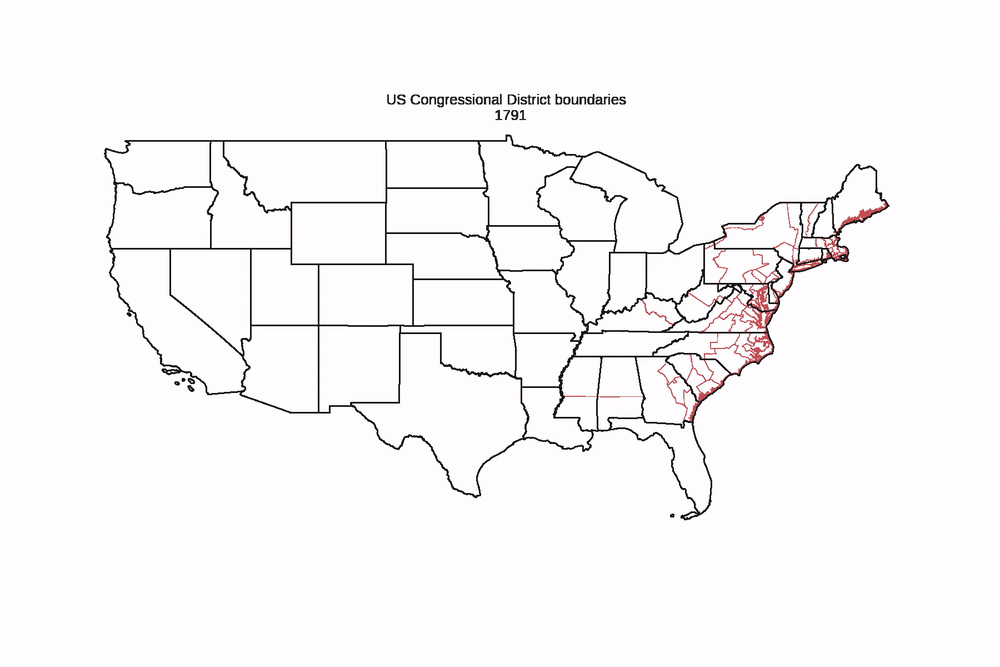

# AnimatedMaps_US_CDs
Example of animated maps in matplotlib + geopandas using entire time series of congressional district maps from UCLA archive

+ `0_get.py`
  + downloads 114 zips of shapefiles to a local directory
  + downloads a crosswalk of congress number to start-year for the figure header
+ `1_animate_congressional_districts_map.ipynb`
  + reads geometries from each of the shapefile zips and pickles geometries 
  + produces an animated map that looks like 

